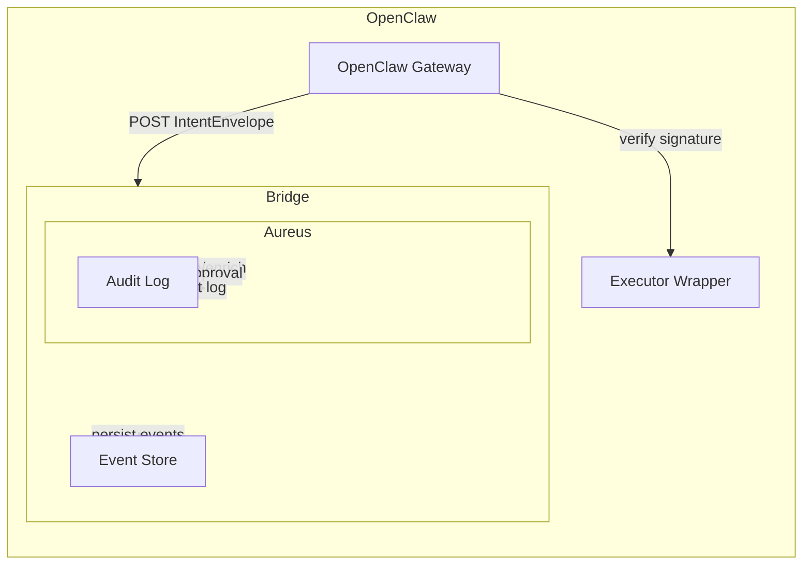

# Component Diagram — Aureus ↔ OpenClaw

```mermaid
graph LR
  subgraph OpenClaw
    OC[OpenClaw Gateway]
    OC -->|POST IntentEnvelope| Bridge
    OC -->|verify signature| Executor[Executor Wrapper]
  end

  subgraph Bridge
    Bridge[Bridge Adapter]
    Bridge -->|validate/enrich| Aureus
    Bridge -->|persist events| EventStore
  end

  subgraph Aureus
    Aureus[Governance Core]
    Aureus -->|sign approval| Bridge
    Aureus -->|audit log| Audit
  end

  EventStore[Event Store]
  Audit[Audit Log]
```