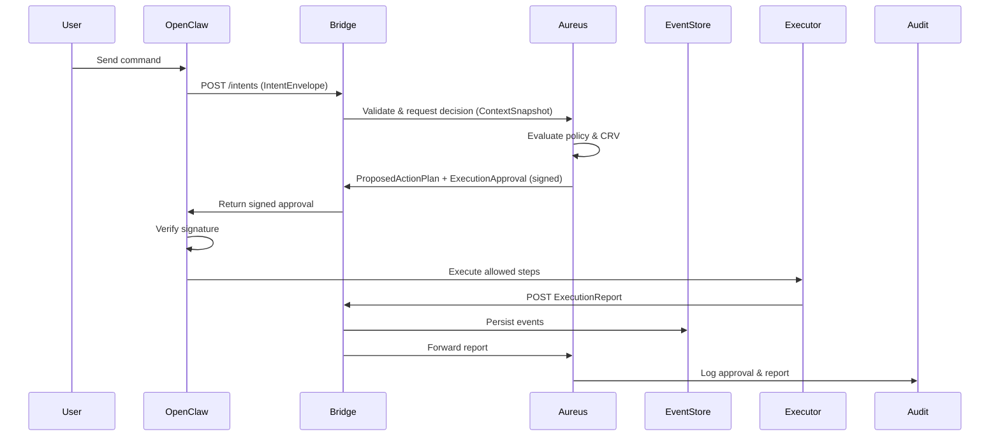
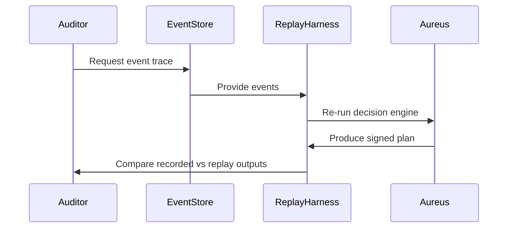

# Sequence Diagrams — Happy Path & Reporting

## Intent → Approval → Execution (happy path)


```mermaid
sequenceDiagram
  participant User
  participant OpenClaw
  participant Bridge
  participant Aureus
  participant EventStore

  User->>OpenClaw: Send command
  OpenClaw->>Bridge: POST /intents (IntentEnvelope)
  Bridge->>Aureus: Validate & request decision (ContextSnapshot)
  Aureus->>Aureus: Evaluate policy & CRV
  Aureus->>Bridge: ProposedActionPlan + ExecutionApproval (signed)
  Bridge->>OpenClaw: Return signed approval
  OpenClaw->>OpenClaw: Verify signature
  OpenClaw->>Executor: Execute allowed steps
  Executor->>Bridge: POST ExecutionReport
  Bridge->>EventStore: Persist events
  Bridge->>Aureus: Forward report
  Aureus->>Audit: Log approval & report
```

## Replay / Verification Flow


```mermaid
sequenceDiagram
  participant Auditor
  participant EventStore
  participant ReplayHarness
  participant Aureus

  Auditor->>EventStore: Request event trace
  EventStore->>ReplayHarness: Provide events
  ReplayHarness->>Aureus: Re-run decision engine
  Aureus->>ReplayHarness: Produce signed plan
  ReplayHarness->>Auditor: Compare recorded vs replay outputs
```
```